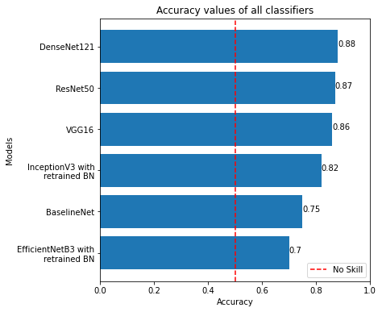
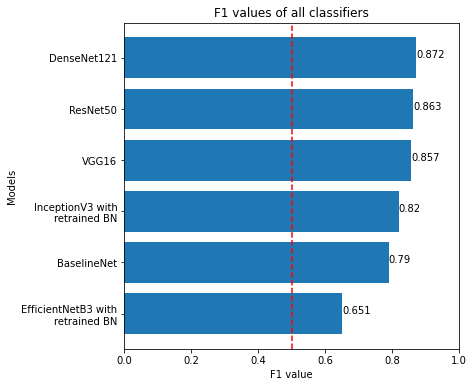
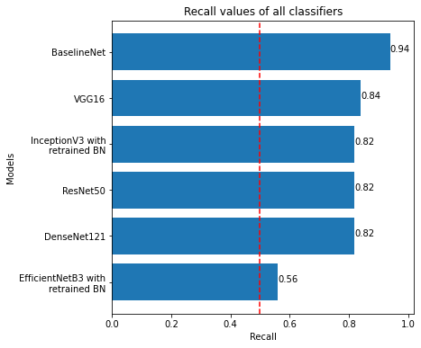
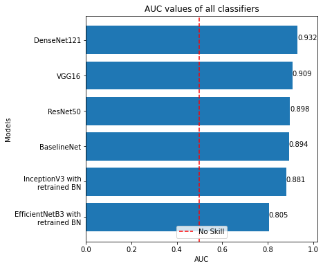
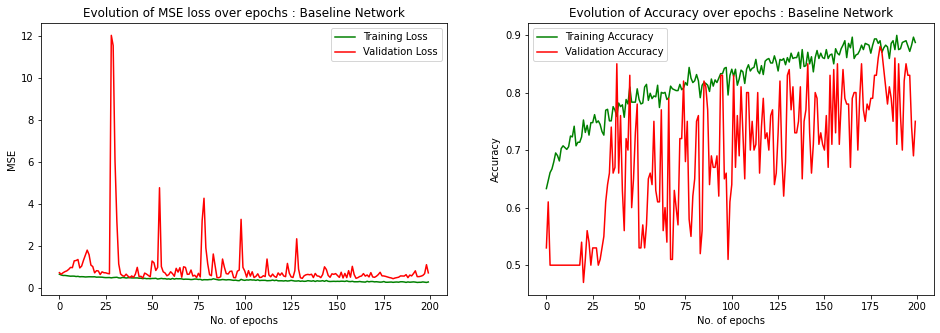
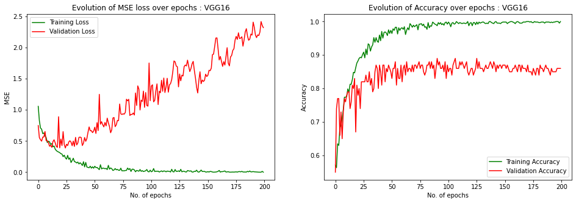
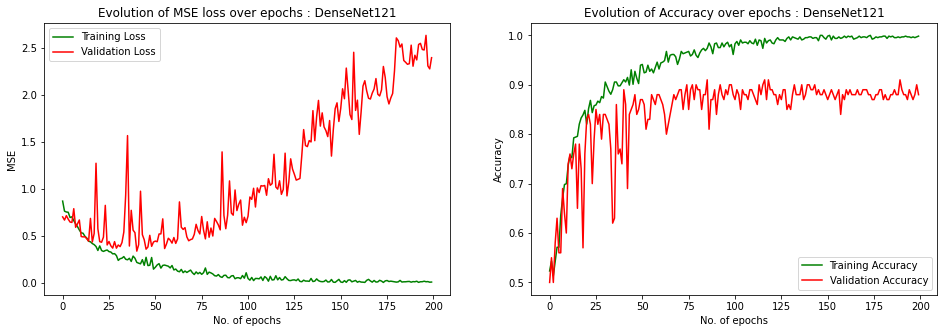
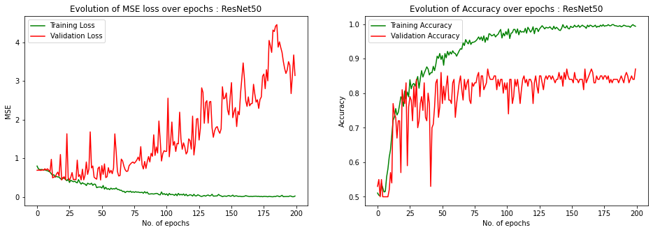
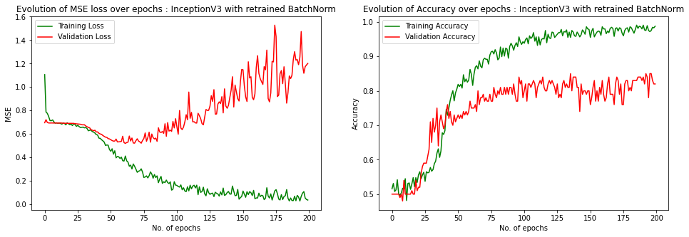
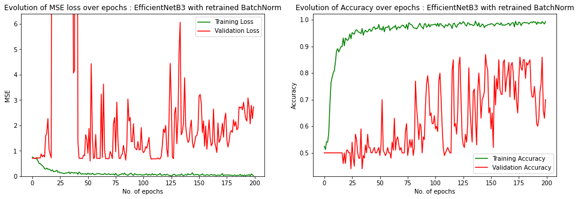

# Diagnosing Covid-19 from Lung CT Scans using transfer learning (VGG16, DenseNet121, InceptionV3, etc.)

**Project Report by Anubhab Das** 

Date : 27th April, 2021

[](https://nbviewer.jupyter.org/github/anubhabdaserrr/lung-ct-scan-covid-pred-transfer-learn/blob/main/lung_ct_scan_covid_pred_nb.ipynb)
[](https://colab.research.google.com/github/anubhabdaserrr/lung-ct-scan-covid-pred-transfer-learn/blob/main/lung_ct_scan_covid_pred_nb.ipynb)

## Objective & data

In this project, I fine-tuned a bunch of pre-trained models like VGG16, InceptionV3, etc. for diagnosing Covid-19 based on Lung CT Scans. The dataset used can be found [here](https://google.com).


**Note : In the context of this project, denoising refers to removal the content of the background (which may not necessarily be "noise" but is treated in this work as such) to successfully extract the foreground text.**

## Model & Training details

### Convolutional Autoencoder Architecture


### Training details
```
Optimizer : Adam with mini-batch gradient descent
beta1 : 0.999
beta2 : 0.999
Learning rate : 0.01 
Loss : Mean Squared Error
Validation Metric : Mean Absolute Error
Mini batch size : 32
No. of epochs : 100
```

## Evaluation & test performance

### Metric Values : 

| Models         	| Accuracy 	| Recall / Sensitivity 	| F1 Score 	| AUC   	|
|----------------	|----------	|----------------------	|----------	|-------	|
| BaselineNet    	| 0.75     	| 0.94                 	| 0.790    	| 0.894 	|
| VGG16          	| 0.86     	| 0.84                 	| 0.857    	| 0.909 	|
| DenseNet121    	| 0.88     	| 0.82                 	| 0.872    	| 0.932 	|
| ResNet50       	| 0.87     	| 0.82                 	| 0.863    	| 0.898 	|
| InceptionV3    	| 0.82     	| 0.82                 	| 0.820    	| 0.881 	|
| EfficientNetB3 	| 0.70     	| 0.56                 	| 0.651    	| 0.805 	|

### Comparison of models based on various metrics :
 
 

### Plot of metrics vs no. of parameters in models :
 


### Loss & Accuracy Curves :








## References
Links go here
