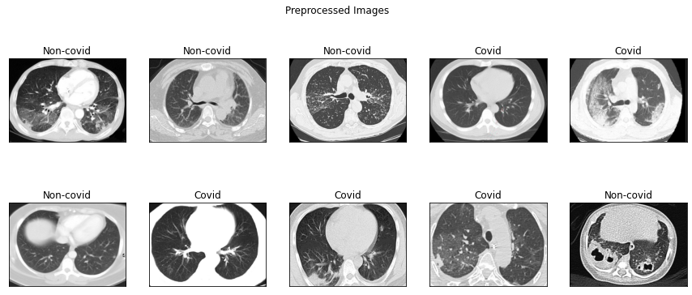
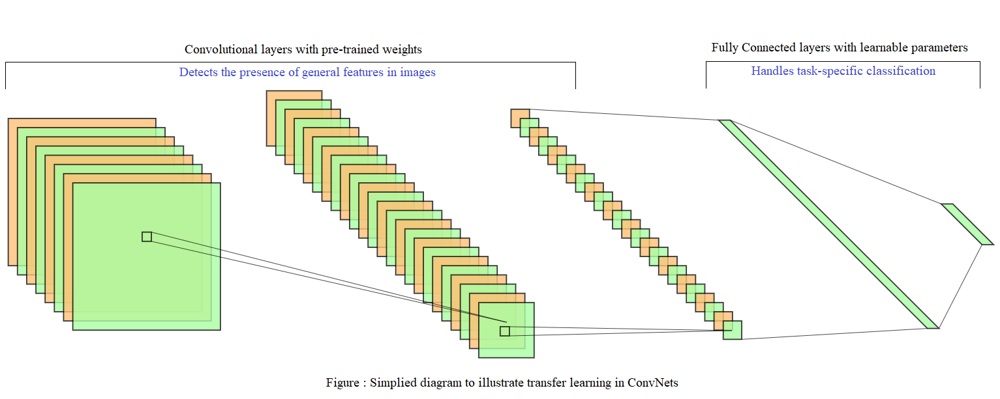
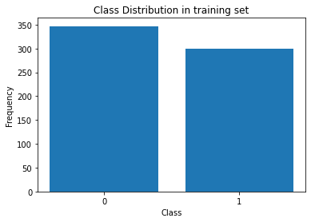
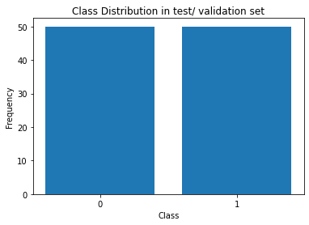
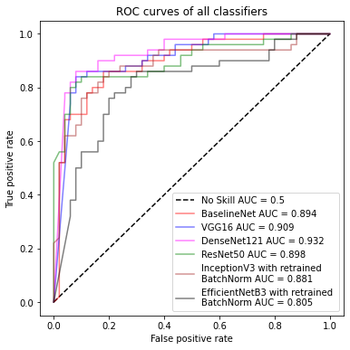
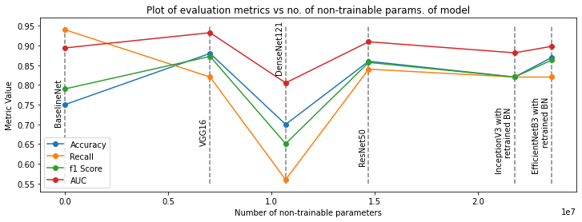

# Diagnosing Covid-19 from Lung CT Scans using transfer learning (VGG16, DenseNet121, InceptionV3, etc.)

**Project Report by Anubhab Das** 

Date : 27th April, 2021

## Objective & data

In this project, I fine-tuned a bunch of pre-trained models like VGG16, InceptionV3, etc. for diagnosing Covid-19 based on Lung CT Scans. The dataset used can be found [here](https://www.kaggle.com/luisblanche/covidct). The inspiration behind this project was primarily to speed-up the diagnostic process by building detection models trained on CT scans which are non-invasive in nature.

**Note : This project is built purely for educational purposes and not for medical diagnosis.**

Transfer learning is basically using the knowledge acquired while finding the solution to a certain problem to solve other problems. Putting it in context of computer vision models using deep convolutional neural networks, when a model is trained on a large dataset, the initial (convolutional) layers learn to detect general features pertaining to image understanding - Like detecting edges followed by composition of these edges and so on. The initial layers serve as feature detectors which are built on top of each other in a hierarchical fashion to obtain more complex features as we go deeper into the network. Because these networks learns to detect general patterns in images, we can "transfer" this learned knowledge to other datasets to faciliate learning. This is particularly useful when our target dataset is small as we can use prior knowledge i.e. pretrained neural networks and tune it to the target dataset. This is done by retraining the final (or the last few) fully connected layers of the network since they're responsible for classification or by adding a few fully connected layers (if need be).

### Train & Test Distribution

 

As is evident from the diagrams, both train & test distributions are almost uniform/ balanced.

## Pre-trained models used

A vanilla CNN (BaselineNet) has been used to serve the purpose of a Baseline Model against which all the other models will be evaluated.

| Models         	| Description 	| 
|----------------	|----------	|
| BaselineNet    	| Vanilla ConvNet based Baseline model     	|
| VGG16          	| Upscaled version of AlexNet (which is the first CNN based winner of ImageNet) in terms of layers.	|
| DenseNet121    	| Made up of dense blocks where each layer is connected to every other layer in a feedforward way. Advantages :  alleviates vanishing-gradient problem, strengthens feature propagation, encourages feature reuse, reduction in no. of parameters. 50-layers Densenet outperforms 152-layers ResNet.  	|
| ResNet50       	| Makes use of skip connections to deal with vanishing gradients as well as to allow the later layers to learn from the information/ feature maps generated by the initial layers     	|
| InceptionV3    	| Makes use of Inception modules as building blocks to reduce compute, which contain multiple branches of Conv. & Pool layers, the ouputs of which are concatenated channel-wise prior to feeding it to the subsequent blocks. Also uses auxiliary classifiers as regularizers.    	|
| EfficientNetB3 	|  Makes use of the idea that carefully balancing network depth, width, and resolution can lead to better performance. The EfficientNet paper was basically a study of model scaling.   	|

The weights of these pre-trained models were obtained by training these models on the ImageNet dataset.

## Evaluation & Comparison

### Model Comparsion | Metric Values : 

| Models         	                  | Accuracy 	| Recall / Sensitivity 	| F1 Score 	| AUC   	|
|----------------	                  |----------	|----------------------	|----------	|-------	|
| BaselineNet    	                  | 0.75     	| **0.94**                 	| 0.790    	| 0.894 	|
| VGG16          	                  | 0.86     	| 0.84                 	| 0.857    	| 0.909 	|
| DenseNet121    	                  | **0.88**     	| 0.82                 	| **0.872**    	| **0.932** 	|
| ResNet50       	                  | 0.87     	| 0.82                 	| 0.863    	| 0.898 	|
| InceptionV3 with retrained BN    	| 0.82     	| 0.82                 	| 0.820    	| 0.881 	|
| EfficientNetB3 with retrained BN 	| 0.70     	| 0.56                 	| 0.651    	| 0.805 	|

*Key : BN - BatchNorm*

DenseNet121 outperforms all models for accuracy, F1 score & AUC metrics. The Baseline model has the highest recall value. Overall, pre-trained models seem to work pretty well in most cases with regards to the aforementioned metrics except for recall. Recall or sensitivity is a very important metric when dealing with diagnostic tests because false negatives are much more unfavourable compared to false positives - The consequence of misdiagnosing a patient who actually has the condition could be catastrophic. However, false positives are not as harmful. Given we're using a balanced test set, accuracy is a good enough metric. The Baseline model has a high recall and low accuracy. This is indicative of the fact that our baseline model might be biased towards classifying test cases as positive (even if they're not). This doesn't particularly seem useful i.e. our baseline model might be closer to a naive model (which classifies all test instances as positive) compared to most of the pre-trained models. In this work, while choosing the best performing model it might make sense to jointly consider accuracy and recall values.

EfficientNetB3 seems to be the worst performing model out of all of the models - It has the lowest scores across all metrics.

The test set is pretty small - approx. 50 instances in each class. Therefore, these numbers might not be a very accurate estimate for out-of-sample model performance.

**Note : Performance of InceptionV3 & EfficientNetB3 were very close to no skill classifiers (i.e. 0.5 out-of-sample accuracy) if the BatchNorm layers were kept frozen. Retraining them helped with improving model performance.**

### ROC Plot

 

It's also clearly evident from this plot that EfficientNetB3 gives the worst performance out of all the models.

### Plot of metrics vs no. of parameters in models :

The purpose of this section is to study reusability of pretrained models to solve the problem at hand - In other words to study the *"degree of transferability"* of pre-trained models. Because, transfer learning would be pointless in case, the final fully connected layers would be doing most of the heavy-lifting when it comes to the task at hand. This, in and of itself, seems like a daunting task hence, a very preliminary attempt has been made at tackling this problem. 

We know that more is the no. of parameters, more is the representational capacity of a model. Owing to this, we study how the value of various performance metrics vary with the no. of non-trainable parameters. But, doesn't this reduce the objective of the current study to basically studying how performance varies with size of the model since most parameters in these big pre-trained models are non-trainable ? (The trainable parameters, which are very small in number are at the end of the network in the fully-connected layers.) - The answer is NO! - It is true, the non-trainable parameters form a very large fraction of the total no. of parameters, or the "size" of the model. However, these parameters are frozen. In a regular performance vs size study, all these parameters would be trainable. Here, increase in size, which is effectiely an increase in the no. of non-trainable parameters can be regarded as a proxy for the **pre-trained representational capacity of the model**, rather than the representaional capacity introduced soleley due to increase in no. of parameters. Pre-trained representational capacity entails the representaional capacity due to increase in the no. of parameters as well as the information as to how good the pre-trained parameter values are, to extract features. 

In the Deep Learning research literature, it has been well documented that bigger (deeper) models lead to better performance. Thus, it seees like, we should be able to confirm the hypotheis that, bigger pre-trained models lead to better performance for other tasks (owing to their higher pre-trained representational capacity), given the pre-trained part of the network isn't too task specific.

 

However, the plot doesn't validate the aforementioned hypothesis. This means, either there's no correlation b/w performance and no. of non-trainable parameters or the assumption that the no. of non-trainable parameters serve as a proxy for pre-trained representational capacity is itself flawed.

(This section is purely experimental and not well-researched, and hence it lacks rigour. How "pre-trained representational capacity" is defined, can be considered vague. On top of that "pre-trained part of the network isn't too task specific" seems like too much of an assumption. )

## Limitations & future directions 
1. Only 6 (5-pretrained) models used to study gain in performance pertaining to increase in size of models. Using more models of different sizes might improve the quality of this study. 
2. Measure of "size" for pre-trained representational capacity of models might not have been very appropriate in the study - We used non-trainable parameters as a measure of size of pre-trained models. Maybe, the depth of networks or a combination of depth & no. of filters maybe a better predictor of performance gain compared to what non-trainable parameters.
3. As mentioned before, size of test set is very small, thus scores might not be representative of out-of-sample performance. Cross-validation yields more representative scores for small datasets. However, that's computationally expensive in Deep Learning.
4. Domain shift might significantly affect performance of these diagnostic models. Different hospitals use different quality of equipments to generate these CT scans - Thus, things like resolution and other attributes of these scans can be significantly different in various hospitals. Models trained on a dataset of images from a particular hospital do not perform well when put to use in other hospitals. The data webpage clearly states *"The images are collected from COVID19-related papers from medRxiv, bioRxiv, NEJM, JAMA, Lancet, etc. CTs containing COVID-19 abnormalities are selected by reading the figure captions in the papers."* This does ensure some diversity in our training set. However, systematic study needs to be conducted to see how these models respond to CT scans from unseen domains.

## References
1. Lecture 9 : CNN Architectures, CS231n lecture notes (Stanford - Spring 2021) [[Link]](http://cs231n.stanford.edu/slides/2021/lecture_9.pdf)
2. (Dataset) Zhao, Jinyu, et al. "Covid-ct-dataset: a ct scan dataset about covid-19." arXiv preprint arXiv:2003.13865 490 (2020). [[Data Link]](https://www.kaggle.com/luisblanche/covidct)  [[Paper Link]](https://arxiv.org/abs/2003.13865)
