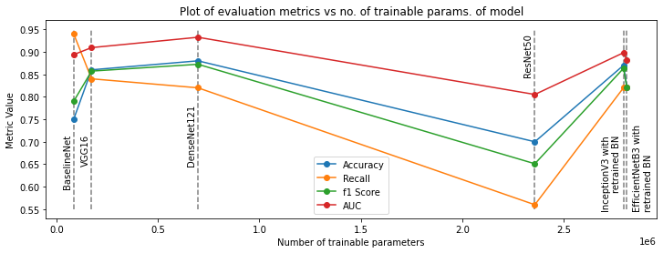
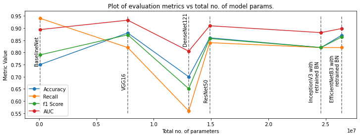

# Diagnosing Covid-19 from Lung CT Scans using transfer learning (VGG16, DenseNet121, InceptionV3, etc.)

**Project Report by Anubhab Das** 

Date : 27th April, 2021

## Objective & data

In this project, I fine-tuned a bunch of pre-trained models like VGG16, InceptionV3, etc. for diagnosing Covid-19 based on Lung CT Scans. The dataset used can be found [here](https://www.kaggle.com/luisblanche/covidct). The inspiration behind this project was primarily to speed-up the diagnostic process by building detection models trained on CT scans which are non-invasive in nature.

**Note : This project is built purely for educational purposes and not for medical diagnosis.**

Transfer learning is basically using the knowledge acquired while finding the solution to a certain problem to solve other problems. Putting it in context of computer vision models using deep convolutional neural networks, when a model is trained on a large dataset, the initial (convolutional) layers learn to detect general features pertaining to image understanding - Like detecting edges followed by composition of these edges and so on. The initial layers serve as feature detectors which are built on top of each other in a hierarchical fashion to obtain more complex features as we go deeper into the network. Because these networks learns to detect general patterns in images, we can "transfer" this learned knowledge to other datasets to faciliate learning. This is particularly useful when our target dataset is small as we can use prior knowledge i.e. pretrained neural networks and tune it to the target dataset. This is done by retraining the final (or the last few) fully connected layers of the network since they're responsible for classification or by adding a few fully connected layers (if need be).

### Train & Test Distribution

 

As is evident from the diagrams, both train & test distributions are almost uniform/ balanced.

## Pre-trained models used

A vanilla CNN (BaselineNet) has been used to serve the purpose of a Baseline Model against which all the other models will be evaluated.

| Models         	| Description 	| 
|----------------	|----------	|
| BaselineNet    	| Vanilla ConvNet based Baseline model     	|
| VGG16          	| Upscaled version of AlexNet (which is the first CNN based winner of ImageNet) in terms of layers.	|
| DenseNet121    	| Made up of dense blocks where each layer is connected to every other layer in a feedforward way. Advantages :  alleviates vanishing-gradient problem, strengthens feature propagation, encourages feature reuse, reduction in no. of parameters. 50-layers Densenet outperforms 152-layers ResNet.  	|
| ResNet50       	| Makes use of skip connections to deal with vanishing gradients as well as to allow the later layers to learn from the information/ feature maps generated by the initial layers     	|
| InceptionV3    	| Makes use of Inception modules as building blocks to reduce compute, which contain multiple branches of Conv. & Pool layers, the ouputs of which are concatenated channel-wise prior to feeding it to the subsequent blocks. Also uses auxiliary classifiers as regularizers.    	|
| EfficientNetB3 	|  Makes use of the idea that carefully balancing network depth, width, and resolution can lead to better performance. The EfficientNet paper was basically a study of model scaling.   	|

The weights of these pre-trained models were obtained by training these models on the ImageNet dataset.

## Evaluation & Comparison

### Model Comparsion | Metric Values : 

| Models         	                  | Accuracy 	| Recall / Sensitivity 	| F1 Score 	| AUC   	|
|----------------	                  |----------	|----------------------	|----------	|-------	|
| BaselineNet    	                  | 0.75     	| **0.94**                 	| 0.790    	| 0.894 	|
| VGG16          	                  | 0.86     	| 0.84                 	| 0.857    	| 0.909 	|
| DenseNet121    	                  | **0.88**     	| 0.82                 	| **0.872**    	| **0.932** 	|
| ResNet50       	                  | 0.87     	| 0.82                 	| 0.863    	| 0.898 	|
| InceptionV3 with retrained BN    	| 0.82     	| 0.82                 	| 0.820    	| 0.881 	|
| EfficientNetB3 with retrained BN 	| 0.70     	| 0.56                 	| 0.651    	| 0.805 	|

*Key : BN - BatchNorm*

DenseNet121 outperforms all models for accuracy, F1 score & AUC metrics. The Baseline model has the highest recall value. Overall, pre-trained models seem to work pretty well in most cases with regards to the aforementioned metrics except for recall. Recall or sensitivity is a very important metric when dealing with diagnostic tests because false negatives are much more unfavourable compared to false positives - The consequence of misdiagnosing a patient who actually has the condition could be catastrophic. However, false positives are not as harmful. Given we're using a balanced test set, accuracy is a good enough metric. The Baseline model has a high recall and low accuracy. This is indicative of the fact that our baseline model might be biased towards classifying test cases as positive (even if they're not). This doesn't particularly seem useful i.e. our baseline model might be closer to a naive model (which classifies all test instances as positive) compared to most of the pre-trained models. In this work, while choosing the best performing model it might make sense to jointly consider accuracy and recall values.

EfficientNetB3 seems to be the worst performing model out of all of the models - It has the lowest scores across all metrics.

The test set is pretty small - approx. 50 instances in each class. Therefore, these numbers might not be a very accurate estimate for out-of-sample model performance.

**Note : Performance of InceptionV3 & EfficientNetB3 were very close to no skill classifiers (i.e. 0.5 out-of-sample accuracy) if the BatchNorm layers were kept frozen. Retraining them helped with improving model performance.**

### Plot of metrics vs no. of parameters in models :

The purpose of this section is to study whether pretrained models actually help us re-use learned feature detectors to solve a different problem. Or, in other words to study the "degree of transferability" of pre-trained models. This, in and of itself, seems like a daunting task hence, a very preliminary attempt has been made at tackling this problem. There seems to be a trend in Deep Learning to keep making models deeper & deeper to obtain better performing models (as in, models with better out-of-sample metric scores).

 

However, the above plots seems to be in contradiction with the aforementioned proposition.

Performance doesn't seem to increase with an increase in the total no. of parameters of the pre-trained model. Size, in this context implies both the the no. of trainable parameters as well as the total no. of parameters.

There is ample evidence in the Deep Learning research literature that increasing the depth of models does produce improved values on these metrics. This means either the latter Conv. layers in the deeper networks are learning filters that are more to less specific to the training dataset and the classification task at hand or the source and target domains are too different - Transfer learning is primarily meant to be used for a task when a pre-trained model has been trained on a similar task. Classifying Covid-19 using CT scans & the ImageNet classification task of diverse real-world entities.

change graphs maybe ? like no. of parameters in fcca re more so arent indicative of transferbaility

## Limitations & future directions 
1. Only 6 (5-pretrained) models used to establish any useful correlation
2. Domain shift problem due to hospital machines
3. As mentioned above, very small test set. Scores might not be representative. WOuld've made mkore sense to use cross-validation however that's computationally expensive in Deep Learning.
4. Measure of "size" of model using parameters not appropriate since most params are at fcc

## References
1. Lecture 9 : CNN Architectures, CS231n lecture notes (Stanford - Spring 2021) [[Link]](http://cs231n.stanford.edu/slides/2021/lecture_9.pdf)
2. (Dataset) Zhao, Jinyu, et al. "Covid-ct-dataset: a ct scan dataset about covid-19." arXiv preprint arXiv:2003.13865 490 (2020). [[Data Link]](https://www.kaggle.com/luisblanche/covidct)  [[Paper Link]](https://arxiv.org/abs/2003.13865)
